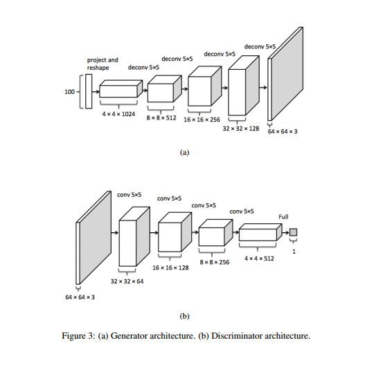
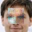

# Semantic Inpainting using DCGANs
* * *
This is an experimental tensorflow implementation of semantic inpainting from corrupted images using DCGANs from the paper [Semantic Image Inpainting with Perceptual and Contextual Losses](https://arxiv.org/abs/1607.07539). A major help was Brandon Amos blog on [Image Completion](https://bamos.github.io/2016/08/09/deep-completion/).One of the major difference between is the training method used.I have used Adam Optimizer instead of gradient descent.
* * * *
## Requirements
* Tensorflow
* glob
* Python 3

* * * *
## Dataset
* I have used Celebrity faces dataset [CelebA](http://mmlab.ie.cuhk.edu.hk/projects/CelebA.html).Download the aligned version ,extract in the same directory as the code

* * * *
## Model Architecture

* * *
## Few Results are Partial Training

>Note: Due to unavailabity of GPU,i didnt train the model for long.This results are after an hour of training

 